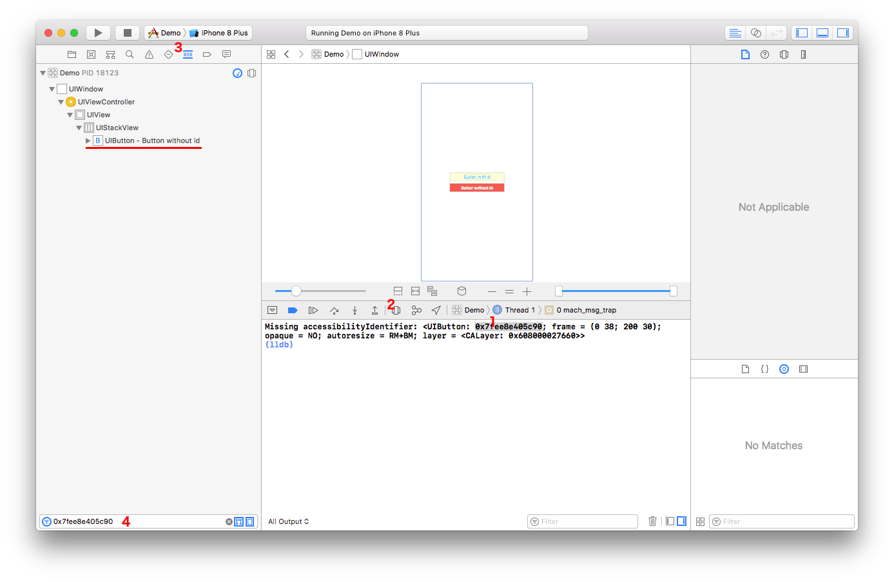

# AccessibilityIdentifierChecker

A small library that warns you about missing accessibility identifiers

### Installation

**CocoaPods**

Add the line `pod "AccessibilityIdentifierChecker", :git => "https://github.com/miquido/accessibility-identifier-checker.git"` to your `Podfile`

### Basic usage

To use just put following code in your `application(_:didFinishLaunchingWithOptions:)`:

```swift
#if DEBUG
    let checker = AccessibilityIdentifierChecker()
    checker.start()
#endif
```

By default the key window will be traversed every 5 seconds and for every view with empty or nil accessibilityIdentifier following message will be printed out in the console:

```Missing accessibilityIdentifier: <UIButton: 0x7fb66a402c60; frame = (0 38; 200 30); opaque = NO; autoresize = RM+BM; layer = <CALayer: 0x608000024760>>```

### How to find view

To easilly find view in your running app:
1. Copy address of view from the Console
2. Open "Debug View Hierarchy"
3. Select "Debug Navigator" tab
4. Paste address into filter textbox



### Advanced configuration

You can configure AccessibilityIdentifierChecker behaviour by passing following parameters in init:

- `rootViewProvider` - the root view provider callback which will be called every check to get root view
- `viewLogger` - the callback that will be called every time checker finds a view with empty or nil accessibilityIdentifier
- `scheduler` - the scheduler used to schedule check call
- `interval` - the interval between checks
- `customViewClasses` - an array of your custom view classes you want to take into account during check
